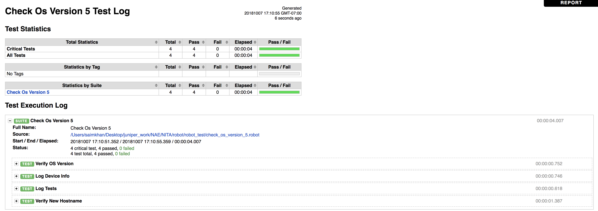
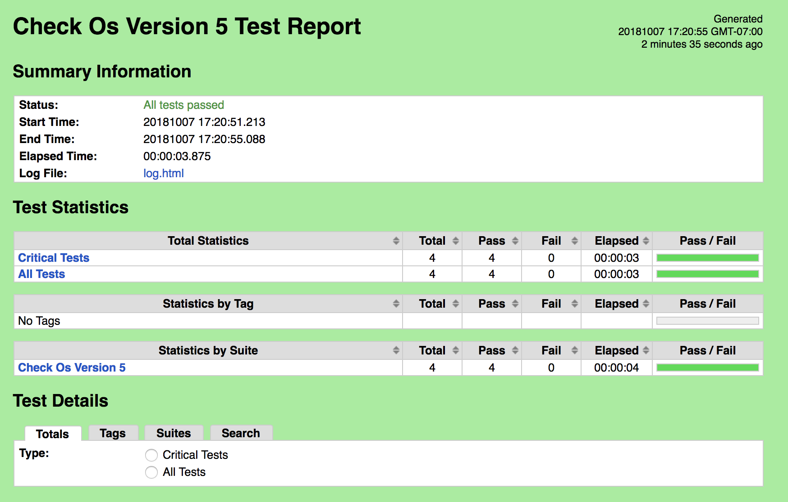

## vSRX automated testing using Robot Framework
 
This is a stepwise demonstration of using the Robot Framework with the Juniper PyEZ Python library for automated network test validation.

### Generated Logs

### Generated Report

